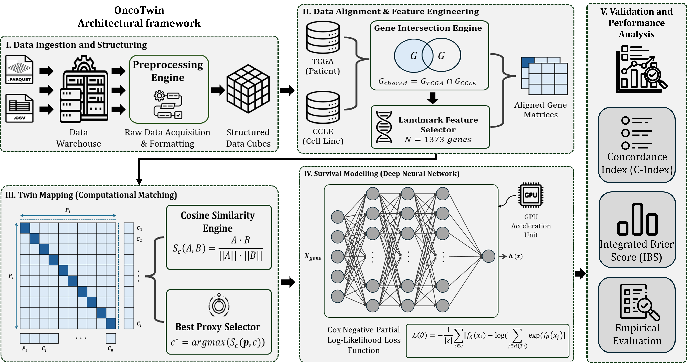

# OncoTwin

**Pathway-Aware Digital Twins for Cross-Domain Survival Prediction and Virtual Treatment Simulation**

[](https://openreview.net/forum?id=FMMscEIr1P)
[](https://openreview.net/forum?id=FMMscEIr1P)
[](LICENSE)
[](https://www.python.org/)

> **Status:** Under review at the International Conference on Machine Learning (ICML 2026).  
> **OpenReview:** [https://openreview.net/forum?id=FMMscEIr1P](https://openreview.net/forum?id=FMMscEIr1P)

---

## Overview

**OncoTwin** is a biologically grounded cross-domain framework that bridges pre-clinical cancer cell lines (CCLE) and patient cohorts (TCGA) through pathway-aware representation alignment. It enables **proxy-transfer survival prediction** without target-domain fine-tuning and supports exploratory virtual treatment simulation.

By encoding transcriptomes at the pathway level, matching each patient tumor to a nearest cell-line “digital twin,” and training a neural hazard estimator under a curriculum strategy, OncoTwin transfers prognostic knowledge across heterogeneous molecular domains while preserving biological structure.

**Key empirical results** (pan-cancer TCGA, \(N = 10{,}218\) patients, 33 cancer types):

| Metric              | OncoTwin     | Best Baseline |
|---------------------|--------------|---------------|
| Concordance Index ↑ | **0.762 ± 0.014** | 0.745 (PRECISE) |
| Integrated Brier Score ↓ | **0.124 ± 0.006** | 0.131 (PRECISE) |

External validation on METABRIC (\(n = 1{,}980\), no retraining) preserves the same ranking.

---

## Motivation

Precision oncology faces a structural asymmetry:

- **Patient cohorts** (e.g., TCGA) offer rich observational survival data but lack counterfactual treatment outcomes.
- **Pre-clinical resources** (e.g., CCLE) provide interventional pharmacological measurements but do not recapitulate the tumor microenvironment, stroma, or immune context of human disease.

Gene-level domain adaptation is fragile under platform batch effects and the compositional mismatch between pure neoplastic cell-line transcriptomes and bulk patient RNA-seq. OncoTwin addresses this by aligning at the **pathway level**—a more stable biological abstraction—and transferring pre-clinical context via digital-twin matching without per-patient fine-tuning.

---

## Key Contributions

1. **Pathway-structured tokenization**  
   Landmark genes (\(D = 1{,}373\)) are aggregated into non-overlapping pathway tokens derived from KEGG / Hallmark collections, yielding a compact, noise-robust, biologically interpretable representation.

2. **Digital twin matching without fine-tuning**  
   Each patient is matched to its nearest cell-line proxy via cosine similarity in pathway space. Alignment uses no patient survival labels.

3. **Curriculum-guided optimization**  
   Two-phase training: (i) unsupervised pathway reconstruction, followed by (ii) supervised Cox partial log-likelihood + pairwise ranking loss, stabilizing learning under right-censored data.

4. **Large-scale evaluation & ablation**  
   Consistent gains over classical (CoxPH, RSF, XGBoost-Surv) and deep (DeepSurv) baselines as well as cross-domain methods (PRECISE, Velodrome). Ablations isolate the contribution of pathway tokens, curriculum learning, and domain alignment. Proxy-similarity stratification shows performance scales with twin quality.

5. **Exploratory virtual trial capability**  
   The framework can simulate heterogeneous treatment-response patterns *in silico*. These outputs are observational and must not be interpreted as causal or clinically actionable.

---

## Method at a Glance

<p align="center">
  
</p>

*Figure: Overview of the OncoTwin pipeline. Patient and cell-line transcriptomes are encoded into pathway tokens, aligned via cosine-similarity digital-twin matching, and optimized with curriculum-guided training for cross-domain survival prediction and virtual treatment simulation.*

### Core Components

| Stage | Description |
|-------|-------------|
| **Landmark alignment** | Shared 1,373-gene space (LINCS L1000 paradigm); CPM + log₂ normalization |
| **Pathway tokenization** | Mean aggregation within curated non-overlapping pathway groups |
| **Proxy identification** | \( c_i^* = \arg\max_j \; S_C(p_{P,i}, p_{C,j}) \) (cosine similarity) |
| **Hazard estimation** | MLP \( f_\theta \) inside the Cox proportional-hazards model |
| **Curriculum** | Phase 1: reconstruction loss → Phase 2: Cox + annealed ranking loss |

---

## Results Snapshot

### Pan-Cancer Performance (TCGA)

| Model              | C-Index ↑          | IBS ↓             |
|--------------------|--------------------|-------------------|
| CoxPH              | 0.684 ± 0.035     | 0.185 ± 0.011    |
| RSF                | 0.728 ± 0.021     | 0.141 ± 0.009    |
| XGBoost-Surv       | 0.735 ± 0.018     | 0.138 ± 0.008    |
| DeepSurv           | 0.741 ± 0.016     | 0.134 ± 0.007    |
| PRECISE            | 0.745 ± 0.019     | 0.131 ± 0.008    |
| Velodrome          | 0.739 ± 0.022     | 0.136 ± 0.009    |
| **OncoTwin**       | **0.762 ± 0.014**  | **0.124 ± 0.006** |

### Ablation Study

| Variant                  | C-Index | IBS   |
|--------------------------|---------|-------|
| Full OncoTwin            | 0.762   | 0.124 |
| w/o Pathway Tokens       | 0.734   | 0.142 |
| w/o Curriculum Learning  | 0.739   | 0.137 |
| w/o Domain Alignment     | 0.728   | 0.145 |

Domain alignment contributes the largest single gain (\(\Delta\) C-Index = −0.034).

### Proxy Similarity Sensitivity

| Similarity Tier       | C-Index | IBS   |
|-----------------------|---------|-------|
| Low (\(S_C < 0.4\))   | 0.721   | 0.147 |
| Medium                | 0.754   | 0.129 |
| High (\(S_C \ge 0.7\))| 0.781   | 0.112 |

Higher-quality digital twins yield substantially better discrimination and calibration.

---

## Repository Structure

```
OncoTwin-notebooks/
├── notebooks/
│   ├── oncotwin.ipynb              # Core implementation
│   ├── onco-twin-v2.ipynb          # Extended experiments
│   ├── onco-twiin-dataset-test.ipynb
│   ├── onco-twing-llm.ipynb        # LLM-related explorations
│   └── note.md
├── rsrc/
│   ├── mtd.png                     # Method overview figure
│   └── not.md
├── LICENSE                         # MIT
└── README.md
```

---

## Getting Started

### Prerequisites

- Python ≥ 3.8
- PyTorch
- Standard scientific stack (`numpy`, `pandas`, `scikit-learn`, `lifelines` or equivalent survival utilities)

### Data

All experiments use publicly available, de-identified resources:

- **TCGA Pan-Cancer** (primary tumors, overall survival)
- **CCLE / DepMap** (cell-line transcriptomes)
- **METABRIC** (external validation)

Landmark gene list follows the LINCS L1000 paradigm (\(D = 1{,}373\)).

### Running the Notebooks

```bash
git clone https://github.com/susb47/OncoTwin-notebooks.git
cd OncoTwin-notebooks
# create & activate your preferred environment
jupyter notebook notebooks/
```

Start with `oncotwin.ipynb` or `onco-twin-v2.ipynb` for the main pipeline.

---

## Important Disclaimers

- OncoTwin is a **research framework for hypothesis generation**.
- Digital-twin matching is based on observational transcriptomic similarity, **not** interventional ground truth.
- Virtual trial outputs **must not** be used to guide clinical treatment decisions.
- Evaluation is currently limited to transcriptomic data and TCGA-derived cohorts; multi-omic and prospective multi-institutional validation remain future work.

---

## Citation

If you find this work useful, please cite the ICML 2026 submission (once the camera-ready version and formal citation are available). In the meantime you may refer to the OpenReview forum:

```bibtex
@inproceedings{oncotwin2026,
  title     = {OncoTwin: Pathway Aware Digital Twins for Cross-Domain Survival Prediction and Virtual Treatment Simulation},
  author    = {Anonymous Authors},
  booktitle = {International Conference on Machine Learning (ICML)},
  year      = {2026},
  note      = {Under review. OpenReview: https://openreview.net/forum?id=FMMscEIr1P}
}
```

---

## License

This repository is released under the [MIT License](LICENSE).  
Copyright © 2026 Susmoy Biswas.

---

## Acknowledgments & Contact

This work builds on publicly available resources from TCGA, CCLE/DepMap, and METABRIC, as well as foundational ideas in survival analysis, domain adaptation, and pathway biology.

For questions regarding the code or notebooks, please open an issue on this repository.  
For the official paper, follow the [OpenReview forum](https://openreview.net/forum?id=FMMscEIr1P).
